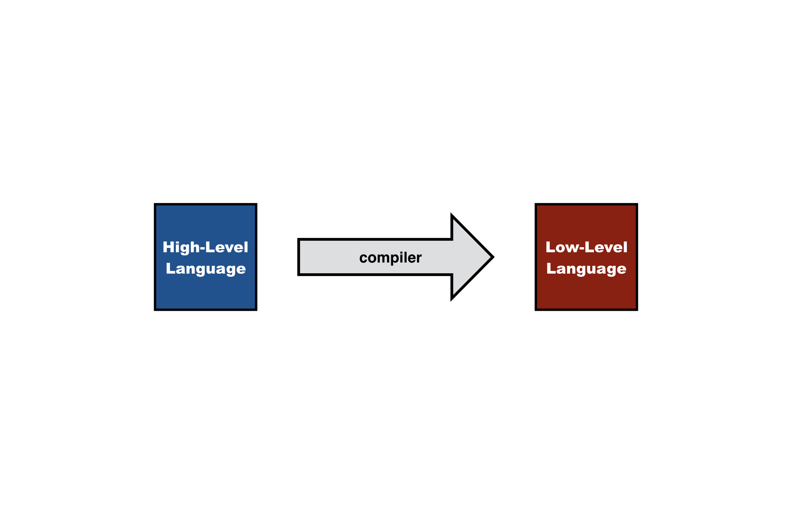
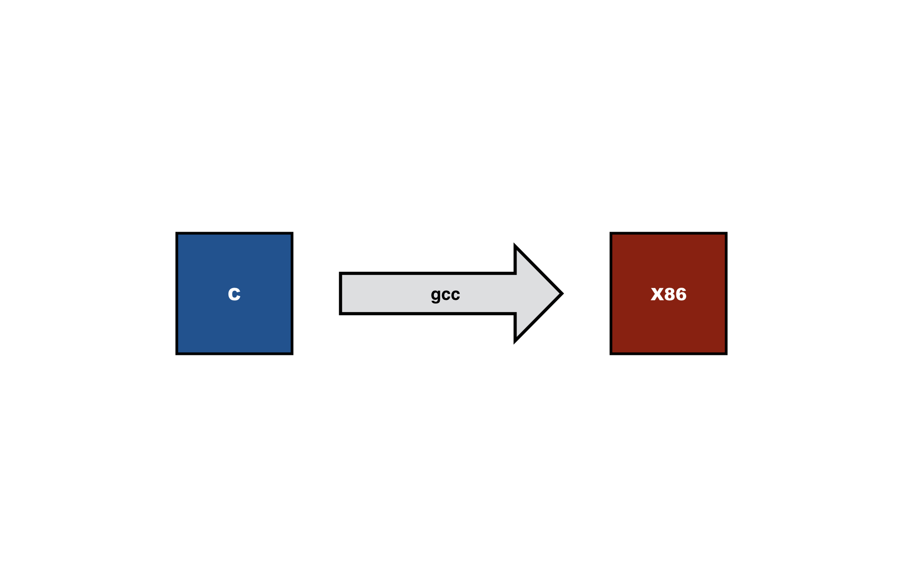
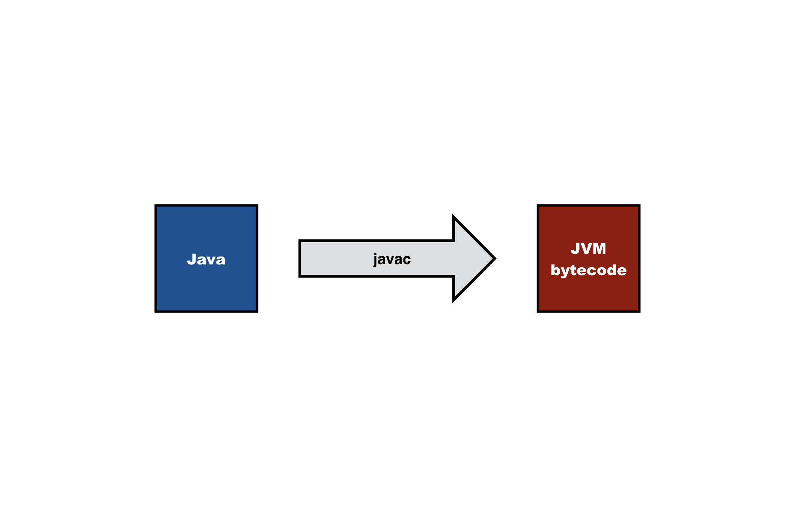
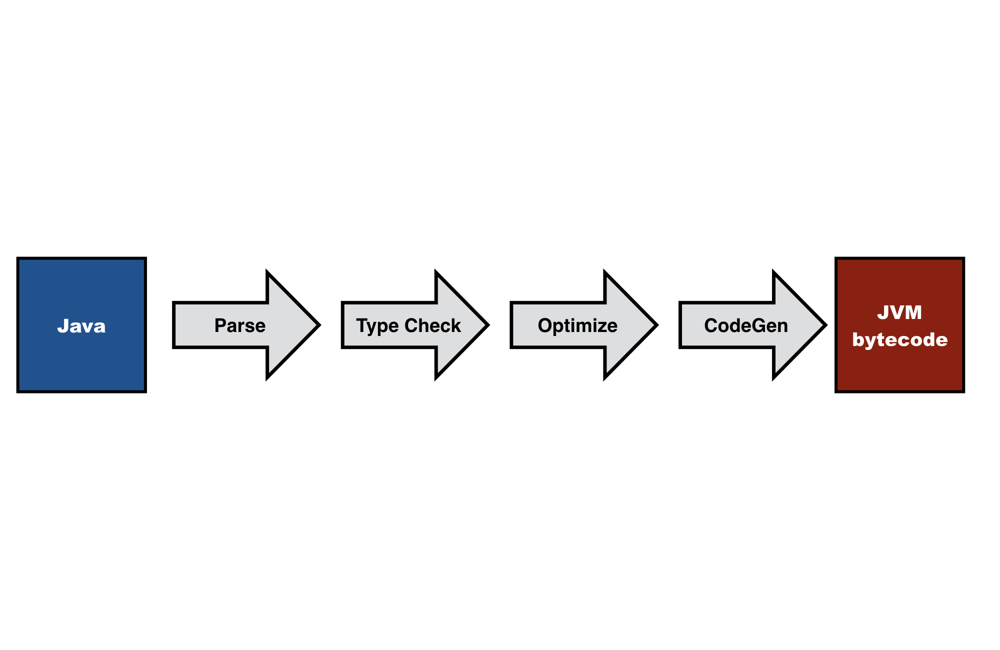
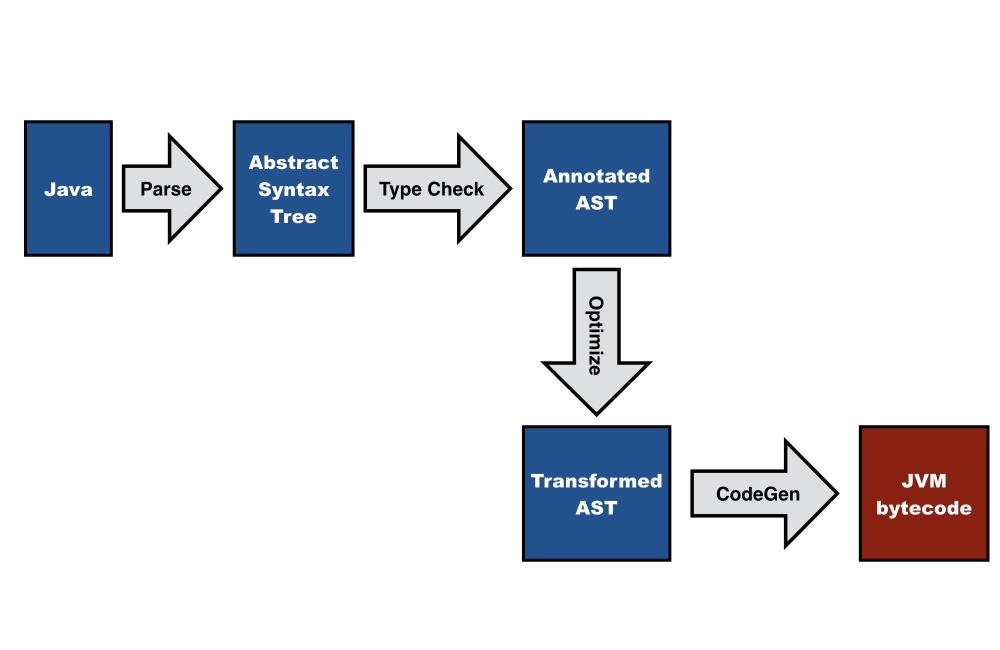
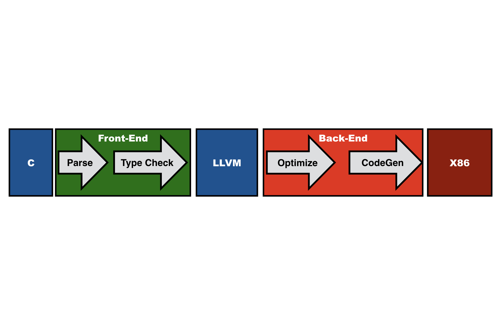

========================================
What is a Compiler?
========================================

This book is about compiler construction. Before we dive into the details of constructing compilers, we need to understand the motivation for doing so.

Slides
-------------------------------------------------------------------------------

.. raw:: html

    <iframe src="http://www.slideshare.net/slideshow/embed_code/key/eSJv3up0pUBk4Q" width="595" height="485" frameborder="0" marginwidth="0" marginheight="0" scrolling="no" style="border:1px solid #CCC; border-width:1px; margin-bottom:5px; max-width: 100%;" allowfullscreen> </iframe> 
 <strong> <a href="http://www.slideshare.net/eelcovisser/declare-your-language-what-is-a-compiler" title="Declare Your Language: What is a Compiler?" target="_blank">Declare Your Language: What is a Compiler?</a> </strong> from <strong><a href="https://www.slideshare.net/eelcovisser" target="_blank">Eelco Visser</a></strong> 

`PDF <https://github.com/metaborg/declare-your-language/raw/master/source/introduction/dyl-1-introduction.pdf>`_

Etymology
-------------------------------------------------------------------------------

What is that word? According to the [WiktionaryCompile]_:

**English**

**Verb**

**compile** (*third-person singular simple present compiles, present participle compiling, simple past and past participle compiled*)
	1.	(transitive) To put together; to assemble; to make by gathering things from various sources. Samuel Johnson compiled one of the most influential dictionaries of the English language.
	2.	(obsolete) To construct, build.
	3.	(transitive, programming) To use a compiler to process source code and produce executable code. After I compile this program I'll run it and see if it works.
	4.	(intransitive, programming) To be successfully processed by a compiler into executable code. There must be an error in my source code because it won't compile.
	5.	(obsolete, transitive) To contain or comprise.
	6.	(obsolete) To write; to compose.

And where does it come from? Again according to the [WiktionaryCompilo]_:

**Latin**

**Etymology**

From con- (“with, together”) +‎ pīlō (“ram down”).
Pronunciation

- (Classical) IPA(key): /komˈpiː.loː/, [kɔmˈpiː.ɫoː]

**Verb**

compīlō (present infinitive compīlāre, perfect active compīlāvī, supine compīlātum); first conjugation

    I snatch together and carry off; plunder, pillage, rob, steal.

How does 'putting together' relate to what we think of as compilers? The `Wikipedia page on The History of Compiler Construction <https://en.wikipedia.org/wiki/History_of_compiler_construction>`_ sheds light on the issue:

| The first compiler was written by Grace Hopper, in 1952, for the A-0 System language. The term compiler was coined by Hopper.[1][2] The A-0 functioned more as a loader or linker than the modern notion of a compiler.

What is a Compiler?
-------------------------------------------------------------------------------

In our modern understanding, compilers are translaters. In particular,
a compiler translates high-level programs to low-level programs

Let's look at some typical instances. A C compiler translates C programs to object code, i.e. instructions for some computer architecture. Examples of C compilers are GCC and clang.

A Java compiler translates Java programs to bytecode instructions for the Java Virtual Machine. In the lab for this

Compiler Architecture
-------------------------------------------------------------------------------

The central topic of a course on compiler construction is understanding what the black box of a compiler looks like inside.

Early compilers were *one-pass* compilers, which look at each line of code only once. This was important in order to fit in the limited memory of those days. This architecture posed limitions on language design, such as declaration before use.

Modern compilers do not suffer the harsh resource constraints of early compilers and are typically designed as a sequence of passes or stages each of which completely process a program or program unit. That is each, pass loads (the representation of) the entire program unit in memory.

Each pass typically changes the representation of the program being compiled. Thus, a compiler can be seen as the composition of a series of translaters, each consuming a program in some representation and producing a program in another representation.

The typical components of a compiler pipeline are:

  - *Parser*: Reads in program text, checks that it complies with the *syntactic* rules of the language, and produces an *abstract syntax tree*, which represents the underlying (syntactic) structure of the program.
  - *Type checker*: Consumes an abstract syntax tree and checks that the program complies with the *static semantic* rules of the language. To do that it needs to perform name analysis, relating uses of names to declarations of names, and checks that the types of arguments of operations are consistent with their specification.
  - *Optimizer*: Consumes a (typed) abstract syntax tree and applies transformations that improve the program in various dimensions such as execution time, memory consumption, and energy consumption.
  - *Code generator*: Transforms the (typed, optimized) abstract syntax tree to instructions for a particular computer architecture. (aka instruction selection)
  - *Register allocator*: Assigns physical registers to symbolic registers in the generated instructions.
  - *Linker*: Most modern languages support some form of modularity in order to divide programs into units. When also supporting *separate compilation*, the compiler produces code for each program unit separately. The linker takes the generated code for the program units and combines it into an executable program.

Retargeting
-------------------------------------------------------------------------------

The passes that make up a compiler are often divided in two clusters, front-end and back-end:

The focus of the front-end is on *analysis*, i.e. parsing (syntactic analysis) and type checking (static analysis).
The focus of the back-end is on *synthesis*, i.e. optimization and code generation.
The advantage of this division is that front-ends and back-ends can be used in multiple combinations, provided they share a common intermediate language:

.. image:: images/dyl-introduction/dyl-introduction.043.png

Why do we need compilers?
-------------------------------------------------------------------------------

So, studying compiler construction means studying these compiler components. And we will.  However, compilers are not quite so stereotypical. The techniques that we study here have more applications than for constructing variants of C and Java. Let's take a step back and investigate why we need compilers in the first place.

Compilers are used to support programming. What is that? And how do they do that?

Programming is instructing a computer to perform computations. The Central Processing Units (CPUs) of computers process low-level operations

  - fetch data from memory
  - store data in register
  - perform basic operation on data in register
  - fetch instruction from memory
  - update the program counter
  - etc.

However, such operations are far removed from the problems we want to address with software.

Programming is Expressing Computational Intent
-------------------------------------------------------------------------------

We use computers to get stuff done

- Buy shoes
- Book a trip
- Design a lecture

We program so that we can use computers to get stuff done. Programs are the intermediaries for getting stuff done

- Web browser
- Shoe webshop
- Text editor

When programming we would like to think about the thing the program is doing for us, i.e. computational thinking:

| "Computational thinking is the thought processes involved in formulating a problem and expressing its solution(s) in such a way that a computer—human or machine—can effectively carry out." [CompThink]_

Writing instructions to fetch data from memory or incrementing the program counter does not contribute to effective computational thinking. *It does not allow us to express our intentions at the right level of abstraction.* The machine does not understand us!

Types of Compilers
-------------------------------------------------------------------------------

So, a compiler is a translater. And often that is understood as a translater from high-level languages to machine languages. However, the techniques employed in the construction of such compilers are also useful in other types of translaters, of which there are many kinds:

- Compiler: translates high-level programs to machine code for a computer
- De-compiler: translates from low-level language to high-level language
- Cross-compiler: runs on different architecture than target architecture
- Source-to-source compiler (transpiler): translate between high-level languages
- Interpreter: directly executes a program (although prior to execution program is typically transformed)
- Bytecode compiler: generates code for a virtual machine
- Just-in-time compiler: defers (some aspects of) compilation to run time
- Hardware compiler: generate configuration for FPGA or integrated circuit

See [CompilerWikipedia]_ for a more extensive discussion and links.

Thus, the classical compiler that translates a high-level imperative language to machine code is just one instance of a large family of programs that operate on programs as data.

Levels of Understanding Compilers
-------------------------------------------------------------------------------

There are many dimensions to the study of compilers and programming languages. The goal of this course is to get a general understanding of the domain of compilation and of the techniques employed in the construction of compilers. That means that you need to go through the following levels of understanding compilers.

At the *base level* you understand the construction of a specific compiler. In this course you will build a compiler that translates MiniJava programs to Java Bytecode. This requires:

- Understanding a programming language (MiniJava)
- Understanding a target machine (Java Virtual Machine)
- Understanding a compilation scheme (MiniJava to Byte Code)

However, you should *generalize* from this experience in order to understand the general principles and architecture of compiler construction. This requires

- Understanding architecture of compilers
- Understanding (concepts of) programming languages
- Understanding compilation techniques

This level of understanding provides you with *design patterns* for programming compilers, which you can employ in the construction of compilers for different languages. Perhaps even for a language of your own design.

However, we can do better than that. Instantiating design patterns can be repetitive and involve a lot of *boilerplate code*. We can abstract from such design patterns through *linguistic abstractions* for sub-domains of compilation. This requires

- Understanding (principles of) syntax definition and parsing
- Understanding (principles of) static semantics and type checking
- Understanding (principles of) dynamic semantics and interpretation/code generation

- Understanding design of meta-languages and their compilation

A First Taste of Compiler Construction
-------------------------------------------------------------------------------

As a first taste of what we will do in this course, browse through the section 'Language Definition with Spoofax' ([Calc]_), which runs through a complete definition of a little calculator language with the Spoofax Language Workbench.

Further Reading
-------------------------------------------------------------------------------

.. [WiktionaryCompile] https://en.wiktionary.org/wiki/compile

.. [WiktionaryCompilo] https://en.wiktionary.org/wiki/compilo#Latin

.. [CompThink] Jeanette M. Wing. Computational Thinking Benefits Society. In Social Issues in Computing. January 10, 2014. <http://socialissues.cs.toronto.edu/index.html>

.. [CompilerWikipedia] <https://en.wikipedia.org/wiki/Compiler>

.. [Calc] Language Definition with Spoofax. A complete example of a Spoofax language definition for a little calculator language. <http://www.metaborg.org/en/latest/source/langdev/meta/lang/tour/index.html>
